# 🗺️ Mapa Mental del Funcionamiento del Portal (LLDM Rodeo)

Este mapa mental describe la arquitectura del sistema completo, dividiéndolo en sus cuatro componentes principales: la **Base de Datos**, la **Pantalla de Proyección**, el **Panel de Administración**, y el **Portal de Miembros**, mostrando cómo se comunican en tiempo real.

```mermaid
flowchart TD
    %% Clases de Estilo
    classDef database fill:#0A192F,stroke:#172A45,stroke-width:2px,color:#8892B0;
    classDef client fill:#0B2A18,stroke:#10B981,stroke-width:2px,color:#A7F3D0;
    classDef admin fill:#3C1A05,stroke:#F97316,stroke-width:2px,color:#FFEDD5;
    classDef portal fill:#1E0A3C,stroke:#8B5CF6,stroke-width:2px,color:#DDD6FE;

    %% Base de Datos
    subgraph DB ["🗄️ Base de Datos (Supabase)"]
        A[("Supabase Real-time Database")]:::database
        A --> T1["profiles (Miembros registrados)"]:::database
        A --> T2["schedule (Oraciones y cultos)"]:::database
        A --> T3["app_settings (Offset, Clima, Config)"]:::database
        A --> T4["announcements (Anuncios mensuales)"]:::database
    end

    %% Pantalla de Proyección
    subgraph Display ["📺 Pantalla de Proyección (/display)"]
        B["Stage Principal (1920x1080 px)"]:::client
        B --> B1["Carrusel de Diapositivas"]:::client
        B1 --> B1a["Calendario Mensual"]:::client
        B1 --> B1b["Agenda del Día (Primicias y Cultos)"]:::client
        B1 --> B1c["Programa Semanal"]:::client
        B1 --> B1d["Anuncios Rotativos"]:::client
        B --> B2["Overlays Compartidos"]:::client
        B2 --> B2a["Reloj y Clima (Rodeo, CA)"]:::client
        B2 --> B2b["Códigos QR (Acceso y Activación)"]:::client
    end

    %% Panel de Administración
    subgraph AdminPanel ["⚙️ Panel de Administración (/admin)"]
        C["Dashboard del Administrador"]:::admin
        C --> C1["Miembros (Gestión de roles y estado)"]:::admin
        C --> C2["Horarios (Planificación del calendario)"]:::admin
        C --> C3["Ajustes (Offset, escala, ZIP clima)"]:::admin
        C3 --> C3a["Geocodificación automática (Open-Meteo)"]:::admin
        C --> C4["Importador (Carga masiva vía imagen/CSV)"]:::admin
    end

    %% Portal de Miembro
    subgraph MemberPortal ["📱 Portal del Miembro (/portal)"]
        D["Activación de Cuenta (/activar)"]:::portal
        D --> D1["Registro cerrado (Filtro por correo pre-registrado)"]:::portal
        D --> D2["Dashboard del Miembro"]:::portal
        D2 --> D2a["Mis Turnos asignados"]:::portal
        D2 --> D2b["Módulo Coro (Partituras / Uniformes)"]:::portal
        D2 --> D2c["Módulo de Jóvenes / Intercesiones"]:::portal
    end

    %% Relaciones y Flujos de Comunicación
    A <-->|Zustand Store / Real-time Sync| B
    A <-->|Acción de Administrador| C
    A <-->|Acceso de Miembros| D
    C3a -.->|Geocodifica ZIP/Ciudad de forma transparente| A
```

---

## 💡 Cómo entender el flujo del sistema:

1. **La Base de Datos (Supabase) es el Cerebro**: Todo cambio que realice el administrador o un miembro se guarda aquí. A través de la tecnología `Real-time`, la base de datos notifica instantáneamente a la pantalla `/display` sin necesidad de recargar la página.
2. **La Pantalla de Proyección `/display` es el Rostro**: Diseñada para proyectores y Smart TVs a resolución fija de 1920x1080px. Adapta su escala y desplazamientos (Offsets) según los Ajustes. Muestra el clima de la ciudad guardada y los códigos QR en el lado izquierdo.
3. **El Panel `/admin` es el Centro de Control**: Permite a los encargados gestionar la congregación, asignar turnos y cambiar las preferencias globales del sitio.
4. **El Portal `/portal` es la Interfaz de la Congregación**: Permite a cada miembro ver sus turnos de oración, descargar partituras, revisar uniformes y subir peticiones de intercesión. Solo pueden acceder miembros pre-registrados por el administrador.
